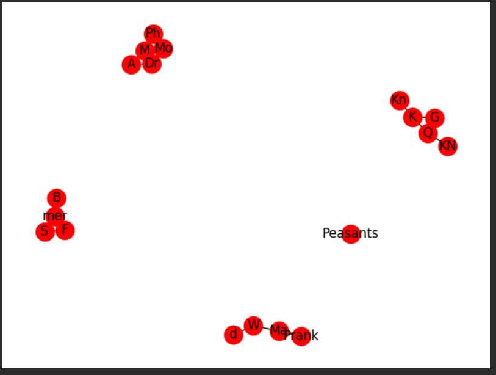
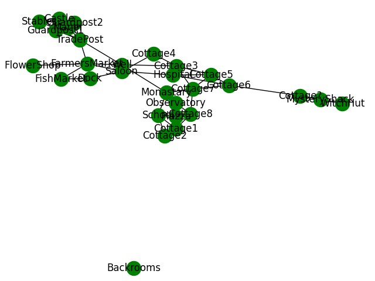
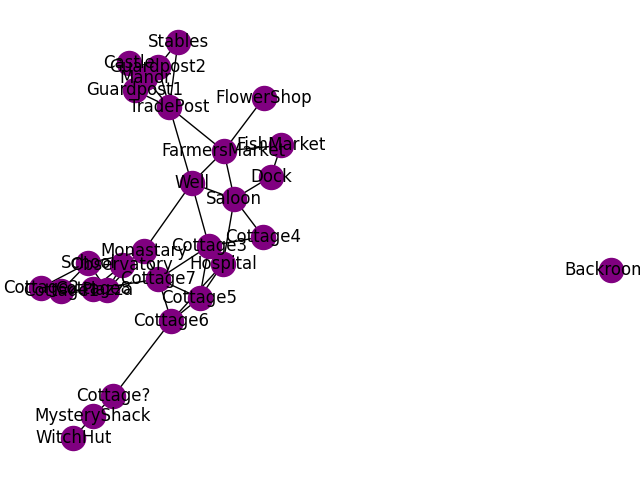
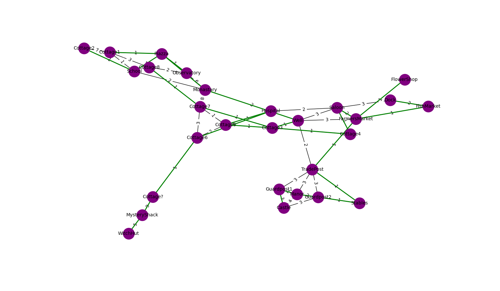

# Title of Your Project

**CISC320 Spring 2023 Lesson 14 - Graph Applications**

Group Members:
* First member aoster@udel.edu
* Second member adtrunzo@udel.edu
* Third member farhanto@udel.edu
* Fourth member (email)

Description of project

## Installation Code

```sh
$> pip install networkx
```

## Python Environment Setup

```python
import networkx as nx
import matplotlib.pyplot as plt
```

# First Problem Title
DFS on FriendShip Graph to Determine Number of Groups (Connected Components) In 
Ancient Kingdom.
**Informal Description**: 
Takes a graph and determines the number of connected components that exist in that graph
> **Formal Description**:
>  * Input: G(V, E): Graph of Vertices and Edges
>  * Output: Int: Number of Connected Components

**Graph Problem/Algorithm**: [DFS]
DFS

**Setup code**:

```python
import networkx as nx
import matplotlib.pyplot as plt


G = nx.Graph()
G.add_node("K") #King
G.add_node("Q") #Queen
G.add_node("Kn") #Knight
G.add_node("Peasants")
G.add_node("G") #Gaurds
G.add_node("F") #Farmer
G.add_node("W") #Witch
G.add_node("Ma") #Magician
G.add_node("M") #Mathematician
G.add_node("A") #Astronomer
G.add_node("S") #Sailor
G.add_node("Mo") #MonK
G.add_node("mer") #Merchant
G.add_node("B") #Botanist
G.add_node("Dr") #Doctor
G.add_node("Prank") #Prankster
G.add_node("d") #drunkard
G.add_node("Ph") #Philosopher
G.add_edge("Ph", "M", )
G.add_edge("M","A")
G.add_edge("W", "Ma")
G.add_edge("Dr", "M")
G.add_edge("Dr", "A")
G.add_edge("K", "Q")
G.add_edge("K", "Kn")
G.add_edge("K", "G")
G.add_edge("Q", "KN")
G.add_edge("Q", "G")
G.add_edge("mer", "F")
G.add_edge("mer", "S")
G.add_edge("F", "S")
G.add_edge("Ma", "W")
G.add_edge("W", "d")
G.add_edge("B", "mer")
G.add_edge("Mo", "M")
G.add_edge("Mo", "Dr")
G.add_edge("Ph", "Mo")
G.add_edge("Prank", "Ma")

nx.draw(G,node_color = "red",with_labels=True, node_size= 300 )
```

**Visualization**:



**Solution code:**

```python
import networkx as nx
import matplotlib.pyplot as plt


G = nx.Graph()
G.add_node("K") #King
G.add_node("Q") #Queen
G.add_node("Kn") #Knight
G.add_node("Peasants")
G.add_node("G") #Gaurds
G.add_node("F") #Farmer
G.add_node("W") #Witch
G.add_node("Ma") #Magician
G.add_node("M") #Mathematician
G.add_node("A") #Astronomer
G.add_node("S") #Sailor
G.add_node("Mo") #MonK
G.add_node("mer") #Merchant
G.add_node("B") #Botanist
G.add_node("Dr") #Doctor
G.add_node("Prank") #Prankster
G.add_node("d") #drunkard
G.add_node("Ph") #Philosopher
G.add_edge("Ph", "M", )
G.add_edge("M","A")
G.add_edge("W", "Ma")
G.add_edge("Dr", "M")
G.add_edge("Dr", "A")
G.add_edge("K", "Q")
G.add_edge("K", "Kn")
G.add_edge("K", "G")
G.add_edge("Q", "KN")
G.add_edge("Q", "G")
G.add_edge("mer", "F")
G.add_edge("mer", "S")
G.add_edge("F", "S")
G.add_edge("Ma", "W")
G.add_edge("W", "d")
G.add_edge("B", "mer")
G.add_edge("Mo", "M")
G.add_edge("Mo", "Dr")
G.add_edge("Ph", "Mo")
G.add_edge("Prank", "Ma")

nx.draw(G,node_color = "red",with_labels=True, node_size= 300 )
print(nx.number_connected_components(G))

```

**Output**

```
5
```

**Interpretation of Results**:
This means that there are 5 different connected graphs. This means that there are 5 different social groups and people are disconnected from one another. It is interesting to see how is more connected to each other than other types of people.


**Informal Description**: 
A notorious witch lives in the town of Cisc, and she gives King Algo the creeps. The King is nervous that the Witch may poison the water supply,
so he asked his most trustworthy Mathematician, Chatus Gptus to determine which roads would provide the quickest travel between the 
castle and the witches hut, allowing the king's knights to swiftly deliever judgement should something suspicious occur. 

Takes a group of locations with roads that connect them, and determines the shortest path from one location to another
> **Formal Description**:
Determine the shortest path between two nodes in a graph. 
>  * Input: G(V, E): Graph of Vertices and Edges
>  * Output: List: List of Nodes in the Shortest Path

**Graph Problem/Algorithm**: [SSSP]
Dijkstra's Algorithm

**Visualization**:




**Setup code**:

```python


G = nx.Graph()
G.add_node("Castle") 
G.add_node("WitchHut") 
G.add_node("FlowerShop") 
G.add_node("Piazza")
G.add_node("FarmersMarket") 
G.add_node("MysteryShack") 
G.add_node("Well") 
G.add_node("Guardpost1") 
G.add_node("Guardpost2") 
G.add_node("FishMarket") 
G.add_node("Cottage1") 
G.add_node("Cottage2") 
G.add_node("Cottage3") 
G.add_node("Cottage4") 
G.add_node("Cottage5") 
G.add_node("Cottage6") 
G.add_node("Cottage7") 
G.add_node("Cottage8") 
G.add_node("Cottage?") 
G.add_node("Observatory") 
G.add_node("Dock") 
G.add_node("Monastary") 
G.add_node("TradePost") 
G.add_node("Hospital") 
G.add_node("Saloon") 
G.add_node("Backrooms") 
G.add_node("School") 
G.add_node("Manor") 
G.add_node("Stables") 
G.add_edge("Castle", "Guardpost1", weight=3)
G.add_edge("Castle", "Guardpost2", weight=3)
G.add_edge("Castle", "Manor", weight=4)
G.add_edge("Manor", "Guardpost1", weight=2)
G.add_edge("Manor", "Guardpost2", weight=2)
G.add_edge("Guardpost1", "TradePost", weight=3)
G.add_edge("Guardpost2", "Stables", weight=1)
G.add_edge("Guardpost2", "TradePost", weight=3)
G.add_edge("Manor", "TradePost", weight=3)
G.add_edge("Stables", "TradePost", weight=1)
G.add_edge("TradePost", "FarmersMarket", weight=1)
G.add_edge("FarmersMarket", "FlowerShop", weight=1)
G.add_edge("FarmersMarket", "FishMarket", weight=1)
G.add_edge("FishMarket", "Dock", weight=2)
G.add_edge("Dock", "Saloon", weight=3)
G.add_edge("FarmersMarket", "Saloon", weight=2)
G.add_edge("FarmersMarket", "Well", weight=3)
G.add_edge("Saloon", "Well", weight=3)
G.add_edge("TradePost", "Well", weight=2)
G.add_edge("Monastary", "Well", weight=2)
G.add_edge("Monastary", "School", weight=2)
G.add_edge("Monastary", "Observatory", weight=6)
G.add_edge("School", "Cottage1", weight=1)
G.add_edge("Cottage2", "Cottage1", weight=7)
G.add_edge("School", "Cottage2", weight=1)
G.add_edge("Cottage1", "Cottage8", weight=3)
G.add_edge("Observatory", "Cottage8", weight=2)
G.add_edge("Monastary", "Cottage7", weight=8)
G.add_edge("Cottage8", "Cottage7", weight=1)
G.add_edge("Cottage7", "Cottage3", weight=1)
G.add_edge("Cottage7", "Cottage5", weight=1)
G.add_edge("Cottage3", "Well", weight=1)
G.add_edge("Cottage6", "Cottage7", weight=3)
G.add_edge("Cottage5", "Cottage6", weight=2)
G.add_edge("Cottage3", "Cottage4", weight=1)
G.add_edge("Cottage4", "Saloon", weight=1)
G.add_edge("Hospital", "Saloon", weight=2)
G.add_edge("Hospital", "Cottage5", weight=1)
G.add_edge("Cottage6", "Cottage?", weight=1)
G.add_edge("Cottage?", "MysteryShack", weight=9)
G.add_edge("MysteryShack", "WitchHut", weight=5)
G.add_edge("Cottage6", "Hospital", weight=1)
G.add_edge("Cottage5", "Cottage3", weight=1)
G.add_edge("Piazza", "School", weight=1)
G.add_edge("Piazza", "Observatory", weight=1)
G.add_edge("Piazza", "Cottage1", weight=1)
G.add_edge("Piazza", "Monastary", weight=1)

nx.draw(G,node_color = "green",with_labels=True, node_size= 300 )
plt.show()
```


**Solution code:**
```python
print(nx.dijkstra_path(G, "Castle", "WitchHut", weight='weight'))

```
**Output**

```
['Castle', 'Guardpost2', 'Stables', 'TradePost', 'Well', 'Cottage3', 'Cottage5', 'Cottage6', 'Cottage?', 'MysteryShack', 'WitchHut']
```

**Interpretation of Results**:
This means that the shortest path from the Castle to the WitchHut is Castle->Guardpost2->Stables->TradePost->Well->Cottage3->Cottage5->Cottage6->Cottage?->MysteryShack->WitchHut


**Graph Problem/Algorithm**: [MST]

Prims Algorithm

**Visualization**:



**Informal Description**: 
A notorious witch lives in the town of Cisc, and she gives King Algo the heebeijeebeis. The King is nervous that the Witch may poison the water supply,
so he asked his most trustworthy Mathemagician, Chatus Gptus to determine which roads would provide the shortest network of roads that he can use to travel within town to reduce the chances of interaction with the big bad witch.

finding the mst of all connections. where all the vertex are connected with the least amount of wieght.


> **Formal Description**:
Determine the MST between all nodes within the graph without any loops
>  * Input: G(V, E): Graph of Vertices and Edges
>  * Output: List: List of Nodes in the Shortest Path


**Setup code**:

```python

from networkx.algorithms import tree
import networkx as nx
import matplotlib.pyplot as plt


G = nx.Graph()
G.add_node("Castle") 
G.add_node("WitchHut") 
G.add_node("FlowerShop") 
G.add_node("Piazza")
G.add_node("FarmersMarket") 
G.add_node("MysteryShack") 
G.add_node("Well") 
G.add_node("Guardpost1") 
G.add_node("Guardpost2") 
G.add_node("FishMarket") 
G.add_node("Cottage1") 
G.add_node("Cottage2") 
G.add_node("Cottage3") 
G.add_node("Cottage4") 
G.add_node("Cottage5") 
G.add_node("Cottage6") 
G.add_node("Cottage7") 
G.add_node("Cottage8") 
G.add_node("Cottage?") 
G.add_node("Observatory") 
G.add_node("Dock") 
G.add_node("Monastary") 
G.add_node("TradePost") 
G.add_node("Hospital") 
G.add_node("Saloon") 
G.add_node("Backrooms") 
G.add_node("School") 
G.add_node("Manor") 
G.add_node("Stables") 
G.add_edge("Castle", "Guardpost1", weight=3)
G.add_edge("Castle", "Guardpost2", weight=3)
G.add_edge("Castle", "Manor", weight=4)
G.add_edge("Manor", "Guardpost1", weight=2)
G.add_edge("Manor", "Guardpost2", weight=2)
G.add_edge("Guardpost1", "TradePost", weight=3)
G.add_edge("Guardpost2", "Stables", weight=1)
G.add_edge("Guardpost2", "TradePost", weight=3)
G.add_edge("Manor", "TradePost", weight=3)
G.add_edge("Stables", "TradePost", weight=1)
G.add_edge("TradePost", "FarmersMarket", weight=1)
G.add_edge("FarmersMarket", "FlowerShop", weight=1)
G.add_edge("FarmersMarket", "FishMarket", weight=1)
G.add_edge("FishMarket", "Dock", weight=2)
G.add_edge("Dock", "Saloon", weight=3)
G.add_edge("FarmersMarket", "Saloon", weight=2)
G.add_edge("FarmersMarket", "Well", weight=3)
G.add_edge("Saloon", "Well", weight=3)
G.add_edge("TradePost", "Well", weight=2)
G.add_edge("Monastary", "Well", weight=2)
G.add_edge("Monastary", "School", weight=2)
G.add_edge("Monastary", "Observatory", weight=6)
G.add_edge("School", "Cottage1", weight=1)
G.add_edge("Cottage2", "Cottage1", weight=7)
G.add_edge("School", "Cottage2", weight=1)
G.add_edge("Cottage1", "Cottage8", weight=3)
G.add_edge("Observatory", "Cottage8", weight=2)
G.add_edge("Monastary", "Cottage7", weight=8)
G.add_edge("Cottage8", "Cottage7", weight=1)
G.add_edge("Cottage7", "Cottage3", weight=1)
G.add_edge("Cottage7", "Cottage5", weight=1)
G.add_edge("Cottage3", "Well", weight=1)
G.add_edge("Cottage6", "Cottage7", weight=3)
G.add_edge("Cottage5", "Cottage6", weight=2)
G.add_edge("Cottage3", "Cottage4", weight=1)
G.add_edge("Cottage4", "Saloon", weight=1)
G.add_edge("Hospital", "Saloon", weight=2)
G.add_edge("Hospital", "Cottage5", weight=1)
G.add_edge("Cottage6", "Cottage?", weight=1)
G.add_edge("Cottage?", "MysteryShack", weight=9)
G.add_edge("MysteryShack", "WitchHut", weight=5)
G.add_edge("Cottage6", "Hospital", weight=1)
G.add_edge("Cottage5", "Cottage3", weight=1)
G.add_edge("Piazza", "School", weight=1)
G.add_edge("Piazza", "Observatory", weight=1)
G.add_edge("Piazza", "Cottage1", weight=1)
G.add_edge("Piazza", "Monastary", weight=1)

nx.draw(G,node_color = "purple",with_labels=True, node_size= 300 )
plt.show()

**Solution code**:

T = nx.minimum_spanning_tree(G)

# Visualize the graph and the minimum spanning tree
pos = nx.spring_layout(G)
nx.draw_networkx_nodes(G, pos, node_color="purple", node_size=600)
nx.draw_networkx_edges(G, pos, edge_color="black")
nx.draw_networkx_labels(G, pos, font_size=10, font_family="sans-serif")
nx.draw_networkx_edge_labels(
    G, pos, edge_labels={(u, v): d["weight"] for u, v, d in G.edges(data=True)}
)
nx.draw_networkx_edges(T, pos, edge_color="red", width=2)
plt.axis("off")
plt.show()

mst = tree.minimum_spanning_edges(G, algorithm="prim", data=False)
edgelist = list(mst)
print(edgelist)


```
**Output**

Shows the updated graph with red lines displaying the MST

[('Stables', 'Guardpost2'), ('Stables', 'TradePost'), ('TradePost', 'FarmersMarket'), ('FarmersMarket', 'FlowerShop'), ('FarmersMarket', 'FishMarket'), ('Guardpost2', 'Manor'), ('TradePost', 'Well'), ('Well', 'Cottage3'), ('Cottage3', 'Cottage7'), ('Cottage3', 'Cottage4'), ('Cottage3', 'Cottage5'), ('Cottage7', 'Cottage8'), ('Cottage4', 'Saloon'), ('Cottage5', 'Hospital'), ('Hospital', 'Cottage6'), ('Cottage6', 'Cottage?'), ('FishMarket', 'Dock'), ('Manor', 'Guardpost1'), ('Well', 'Monastary'), ('Monastary', 'Piazza'), ('Piazza', 'School'), ('Piazza', 'Observatory'), ('Piazza', 'Cottage1'), ('School', 'Cottage2'), ('Guardpost2', 'Castle'), ('Cottage?', 'MysteryShack'), ('MysteryShack', 'WitchHut')]


**Interpretation of Results**:
Without any cycles this is the connection of all the points in the 
most efficient way to connect all the locations with the minimum amount of travel or distance.

The MST consists of the following connections:

Stables - Guardpost2
Guardpost2 - Manor
Manor - Guardpost1
Guardpost2 - Castle
Castle - TradePost
TradePost - Well
Well - Monastery
Monastery - Piazza
Piazza - School
School - Cottage2
Cottage2 - Cottage1
Cottage1 - Observatory
Observatory - MysteryShack
MysteryShack - WitchHut